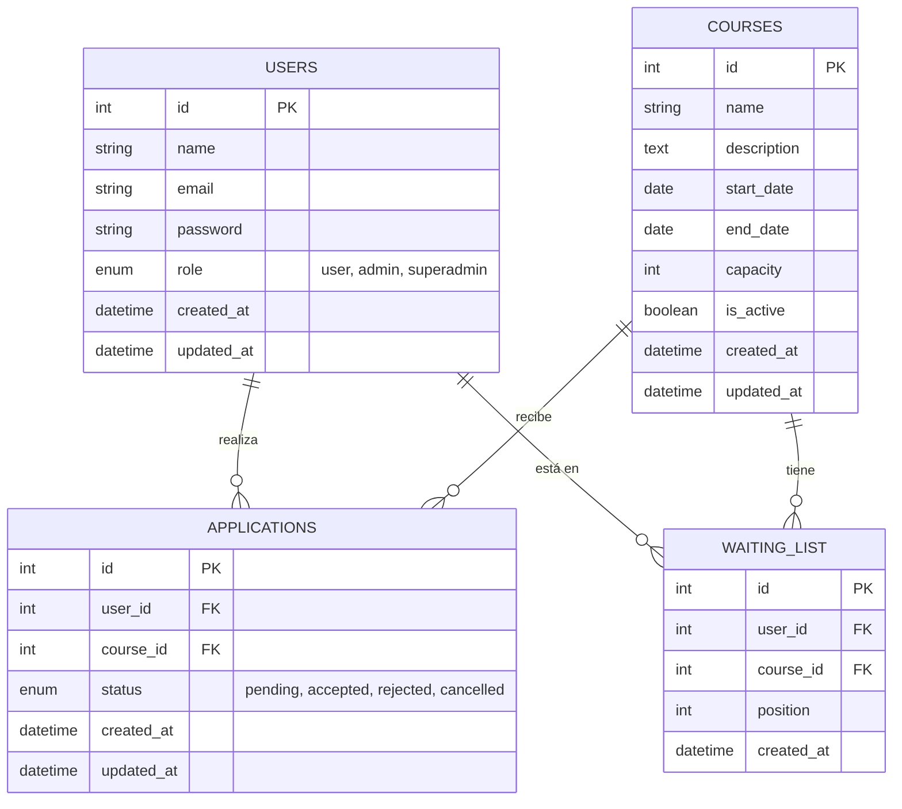

README – Backend CourseFlow (FastAPI + PostgreSQL + Alembic + Docker)
1. Introducción
Este backend implementa la API del proyecto CourseFlow, una plataforma para gestionar cursos, solicitudes de inscripción y listas de espera.
Está construido con:
• FastAPI (framework principal)
• SQLAlchemy (ORM)
• PostgreSQL (base de datos)
• Alembic (migraciones)
• Docker + docker‑compose (entorno reproducible)
• JWT (autenticación)
• Arquitectura modular y escalable
La estructura está adaptada a las necesidades del bootcamp y a la organización real del equipo.
---
2. Estructura del proyecto
Esta es la estructura actual del repositorio backend:

```text
CourseFlow_Backend/
├── app/
│   ├── __init__.py
│   ├── main.py
│   ├── config.py
│   ├── alembic/
│   │   └── env_1.py
│   ├── api/
│   │   ├── deps.py
│   │   └── v1/
│   │       ├── routes_auth.py
│   │       ├── routes_users.py
│   │       ├── routes_courses.py
│   │       ├── routes_applications.py
│   │       └── routes_waiting_list.py
│   ├── core/
│   │   ├── config.py
│   │   └── security.py
│   ├── db/
│   │   ├── base.py
│   │   └── session.py
│   ├── models/
│   │   ├── __init__.py
│   │   ├── user.py
│   │   ├── course.py
│   │   ├── application.py
│   │   └── waiting_list.py
│   ├── schemas/
│   │   ├── __init__.py
│   │   ├── user_schema.py
│   │   ├── course_schema.py
│   │   ├── auth_schema.py
│   │   └── application_schema.py
│   ├── routes/
│   │   ├── __init__.py
│   │   ├── auth.py
│   │   ├── courses.py
│   │   └── applications.py
│   └── utils/
│       ├── __init__.py
│       └── decorators.py
├── tests/
│   └── test_health.py
├── docs/
├── project/
├── Dockerfile
├── docker-compose.yml
├── requirements.txt
├── README.md
└── .env.example
```

3. Explicación de cada carpeta
`app/main.py`
Punto de entrada de FastAPI.
Aquí se inicializa la app, CORS y se incluyen las rutas.
---
`app/api/`
Contiene toda la lógica de la API.
`api/deps.py`
Dependencias comunes, como la sesión de DB (get_db()).
`api/v1/`
Rutas organizadas por módulo:

| Archivo | Función |
|---------|----------|
| routes_auth.py | Login, JWT |
| routes_users.py | Registro y gestión de usuarios |
| routes_courses.py | CRUD de cursos |
| routes_applications.py | Solicitudes de inscripción |
| routes_waiting_list.py | Lista de espera |

`app/models/`
Modelos SQLAlchemy que representan las tablas:
• user.py
• course.py
• application.py
• waiting_list.py
El archivo models/__init__.py importa todos los modelos para que Alembic pueda detectarlos.
---
`app/schemas/`
Schemas Pydantic usados para:
• Validar datos de entrada
• Formatear respuestas
• Documentar la API
Tus nombres personalizados:

| Archivo | Contenido |
|---------|----------|
| user_schema.py | UserCreate, UserRead |
| auth_schema.py | LoginRequest, TokenResponse |
| course_schema.py | CourseCreate, CourseRead |
| application_schema.py | ApplicationCreate, ApplicationRead |
| waiting_list_schema.py | WaitingListCreate, WaitingListRead |

`app/core/`
Configuración central del backend.
`core/config.py`
Carga variables de entorno y configuración general.
`core/security.py`
Funciones de seguridad:
• Hash de contraseñas
• Verificación
• Generación de JWT
---
`app/db/`
Conexión a la base de datos.
`session.py`
Crea el engine y la sesión SQLAlchemy.
`base.py`
Define la clase Base para todos los modelos.
---
`app/alembic/env_1.py`
Este archivo es la configuración de Alembic.
• Lo creó Alembic automáticamente
• Tú lo editaste para conectar migraciones con tus modelos
• Es el “cerebro” que permite generar migraciones
---
`app/routes/`
Carpeta creada por tu compañero.
Actualmente no se usa, porque las rutas reales están en api/v1/.
Puedes:
• Eliminarla
• O usarla para rutas internas no versionadas
---
`app/utils/`
Funciones auxiliares.
decorators.py está vacío por ahora.
---
`tests/`
Pruebas automáticas con pytest.
test_health.py verifica que la API responde.
---
4. Base de datos y migraciones (Alembic)
¿Qué es Alembic?
Sistema de migraciones para SQLAlchemy.
¿Dónde está configurado?
En:
app/alembic/env_1.py
¿Cómo generar una migración?**
alembic revision -m "init"
Esto crea un nuevo archivo de migración en app/alembic/versions/.
¿Cómo aplicar migraciones?**
alembic upgrade head
Esto actualiza la base de datos al último estado definido por las migraciones.

### Modelo Relacional de Datos

El sistema utiliza un esquema relacional donde los **Usuarios** se inscriben en **Cursos** a través de **Solicitudes** (Applications). Además, existe una **Lista de Espera** para gestionar el cupo de los cursos cuando la capacidad se agota.

#### Diagrama Entidad-Relación (ERD)



#### Descripción de las Relaciones

*   **Usuarios <-> Solicitudes (1:N):** Un usuario puede tener múltiples solicitudes (una por curso), pero cada solicitud pertenece a un único usuario.
*   **Cursos <-> Solicitudes (1:N):** Un curso puede recibir múltiples solicitudes de inscripción, pero cada solicitud está vinculada a un único curso.
*   **Relación Muchos a Muchos (M:N):** Los usuarios y los cursos están relacionados indirectamente a través de la tabla `applications`, que actúa como tabla de unión con metadatos adicionales (el estado de la inscripción).
*   **Lista de Espera:** Vincula usuarios con cursos cuando el cupo está lleno, manteniendo un orden secuencial mediante el campo `position`.
5. Docker y docker-compose
Levantar todo el backend:
```bash
docker compose up --build -d
```
Esto construye la imagen, levanta PostgreSQL, ejecuta las migraciones automáticamente (vía entrypoint) y levanta el contenedor con FastAPI.

Servicios incluidos:
• backend → FastAPI
• db → PostgreSQL
• pgadmin → Interfaz para PostgreSQL (http://localhost:5050)

Poblar la base de datos (Seed):
Para insertar datos de prueba iniciales (administradores, usuarios, cursos y solicitudes), ejecuta:
```bash
docker compose exec backend python scripts/seed.py
```

  6. Autenticación (JWT)
El flujo:
1. Usuario se registra (POST /api/v1/users)
2. Usuario inicia sesión (POST /api/v1/auth/login)
3. El backend genera un JWT
4. El frontend lo guarda y lo envía en cada petición.

 7. Endpoints principales

| Módulo | Método | Endpoint |
|--------|--------|----------|
| Usuarios | POST | /api/v1/users |
| Usuarios | GET | /api/v1/users/{id} |
| Auth | POST | /api/v1/auth/login |
| Cursos | POST | /api/v1/courses |
| Cursos | GET | /api/v1/courses |
| Cursos | GET | /api/v1/courses/{id} |
| Solicitudes | POST | /api/v1/applications |
| Solicitudes | GET | /api/v1/applications |
| Solicitudes | GET | /api/v1/applications/{id} |
| Lista de espera | POST | /api/v1/waiting_list |
| Lista de espera | GET | /api/v1/waiting_list |
| Lista de espera | GET | /api/v1/waiting_list/{id} |
| Lista de espera | GET | /api/v1/waiting-list/{course_id} |

---
8. Testing
Ejecutar pruebas:
pytest -q
Esto ejecuta todas las pruebas en la carpeta tests/.
Actualmente solo hay una prueba de salud, pero puedes agregar más para cubrir toda la lógica del backend.

9. Flujo general del backend
1. FastAPI recibe la petición
2. La ruta correspondiente valida datos con schemas
3. Se abre una sesión de DB con deps.get_db()
4. Se ejecuta la lógica usando models SQLAlchemy
5. Se devuelve la respuesta formateada con schemas
6. Alembic mantiene la BD sincronizada
7. Docker garantiza que todo funcione igual en todos los equipos
---
10. Cómo extender el proyecto
Puedes añadir:
• Roles avanzados
• Estados de solicitud
• Promoción automática desde lista de espera
• Notificaciones por email
• Dashboard admin
La arquitectura ya está preparada para crecer.
---
11. Conclusión
Este README explica:
• Cómo está organizado el backend
• Qué hace cada archivo
• Cómo se conectan FastAPI, SQLAlchemy, Alembic y Docker
• Cómo levantar el proyecto
• Cómo ejecutar migraciones y tests